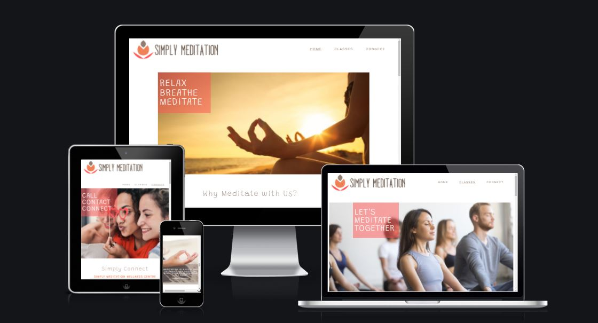

# Simply Meditation
Developer - Lynda Phelan

Simply Meditation is a website designed to promote a number of meditation classes in Dublin city provided by Simply Meditation Wellness Centre. As well as a space to list their meditation classes and provide additional information regarding different meditation styles and techniques covered by the centre, the site is also aesthetically designed to promote meditation as a way to bring more peace, calm and balance into one's everyday life. The site will target individuals who are looking to find a place that teaches meditation in a group setting from beginner level to more advanced meditation practices. Simply Meditation will be a user-friendly site which is easy to navigate for new users and returning users to find out exactly what meditation classes are on what day and at what time. The site will also promote Simply Meditation Wellness Centre as a warm welcoming environment and a space where users feel comfortable getting in touch to ask questions about meditation in general and/or the types of meditation classes that are being advertised.

[Live Webpage](https://lyn-da.github.io/simply-meditation/)

## Features
The site consists of three pages and sixteen features

### Logo and Navigation Bar
- Featured on all three pages
- The navigation bar is fully responsive and identical on all three pages which allows for easy navigation
- Includes links to the Logo, Homepage, Classes and Connect page
- The active page is highlighted by an underline in the navigation menu
- This section is valable to the user as it allows the user to explore the site easily and without distraction

### Main Image
- Featured on all three pages
- Introduces the user to each page with an eye-catching image designed to promote a state of peace and happiness
- Includes an image which represents the nature of the site as well as the page that is currently open
- Each image includes a text overlay which highlights the nature of the site as well as the page that is currently open
- This section is fully responsive; when viewed on smaller devices the text overlay adjusts to the left and the image resizes accordingly
- This section is valable to the user as it provides a visual representation of how meditation can be incorporated into your life

### About Us Section
- Featured on Homepage
- Provides a short description about the Simply Meditation Wellness Centre (Left)
- Promotes a welcome message to all, encouraging a warm sense of curiosity in the user
- Includes an accompanying image which promotes meditation as something one can do with others (Right)
- This section underpins the idea of learning to meditate in a class setting
- Provides a design feature that runs across the site, promoting good user experience
- This section is fully responsive, changing from horizontal to vertical when viewed on smaller devices
- This section is valable to the user as it provides basic information that encourages a sense of familiarity and confidence

### About Meditation Section
- Featured on Homepage
- Provides a short description about the benefits of meditation for one's overall health and wellbeing (Right)
- Includes an accompanying image which points to the idea of achieving inner peace (Left)
- Both text and image encourages the user to consider joining a meditation class to gain the benefits outlined
- Provides a design feature that runs across the site, promoting good user experience
- This section is fully responsive, changing from horizontal to vertical when viewed on smaller devices
- This section is valable to the user as it provides basic information regarding the benefits of meditation

### Inspirational Quote Section
- Featured on Homepage
- Includes an image which represents the nature of the site overall and the chosen quote
- Image includes a text overlay with inspirational quote by Deepak Chopra, a prominent figure in the holistic wellness industry
- Image and text overlay is in keeping with the main image on all three pages thus creating a sense of aesthetic harmony
- This section is fully responsive, the image and overlay text adjusts in size when viewed on smaller devices
- This section is valable to the user as it suggests an alignment between Simply Meditation and a wellknown figure such a Deepak Chopra

### Further Information Section
- Featured on Homepage
- Includes a little info about where the user can find out more information on the site regarding meditation techniques, classes and enquiries
- Includes three hyperlinks that correlate with the titles: Techniques, Classes & Enquires, and directs the user accordingly across the site
- Includes a background image that covers the whole section, an image that leads nicely on from the above image displaying the quote
- The overall section is fully responsive, when viewed on smaller devices it changes from four vertical columns to three horizontal rows
- This section is valable to the user as it provides direction regarding where to find out more information and how to make an enquiry

### Testimonial Section 
- Featured on all three pages
- Provides the user social proof relative to the meditation classes run by Simply Meditation Wellness Centre (Left)
- Includes an accompanying image of the individual who is providing the testimonial (Right)
- Provides a design feature that runs across the site, promoting good user experience
- This section is fully responsive, changing from horizontal to vertical when viewed on smaller devices
- This section is valable to the user as it provides social proof, an invaluable asset to any business

### Newsletter Sign-Up Section
- Featured on all three pages
- Provides the user with an opportunity to sign up to a newsletter in order to receive the latest news from Simply Meditation
- Includes a form element which allows for the user to submit their email address to sign up for the newsletter
- Includes background image which continues to promote peace, calm and tranquility 
- Form element is displayed as a transparent text overlay which partly covers the background image 
- Sign Up Button is displayed as a bright pink colour to grab the attention of the user
- This section is full responsive, when viewed on smaller devices the text overlay adjusts accordingly and the image is resized
- This section is valuable to the user as it offers the user yet another way to receive information from Simply Meditation

### The Footer
- Featured on all three pages
- Includes links to Simply Meditation's Facebook, Twitter and Instagram accounts
- All links when clicked open in a new tab which allows for easy navigation
- This section is responsive, when viewed on the smallest viewport the footer reduces in size which creates better visual harmony
- This section is valuable to the user as it directs the user towards further engagement with Simply Meditation via social media

### Meditation Classes Section
- Featured on classes page
- Provides the user with information regarding class schedule and is broken up into five sections for mon-fri
- This section will be updated regularly as class days/times change
- Provides info such as what type of meditation class, what is the cost to attend the class, what day of the week it's on and at what time
- The overall section includes a background image of an artistic nature which is also utilised for the techniques section allowing for visual consistency
- The overall section is fully responsive, when viewed on smaller devices it changes from five vertical columns to five horizontal rows
- This section is valuable to the user as it provides vital information regarding pricing structure and class scheduling

### Meditation Styles Section
- Featured on classes page
- Provides the user with information regarding the three main meditation styles covered by Simply Meditation Wellness Centre
- The overall section includes a background image of an artistic nature which was utilised already for the further information section on the homepage, allowing for visual consistency and good user experience
- The overall section is fully responsive, when viewed on smaller devices it changes from three vertical columns to three horizontal rows
- This section is valuable to the user as it provides information regarding the different meditation styles and what the user can expect to learn

### Meditation Techniques Section
- Featured on classes page
- Provides the user with information regarding some meditation techniques covered in class by Simply Meditation
- The overall section includes a background image of an artistic nature which is also used for the classes section allowing for visual consistency
- The overall section is fully responsive, when viewed on smaller devices it changes from five vertical columns to five horizontal rows
- This section is valuable to the user as it provides more information regarding different meditation techniques one can expect to learn

### Simply Connect Section
- Featured on connect page
- Provides a little message about reaching out if the user has any questions (Left)
- Includes an accompanying image which promotes making contact and connecting with the centre (Right)
- Provides a design feature that runs across the site, promoting good user experience
- This section is fully responsive, changing from horizontal to vertical when viewed on smaller devices
- This section is valable to the user as it promotes the idea that the user is most welcome to connect

### Contact Information Section
- Featured on connect page
- Includes vital contact information: loaction, contact number and email address
- Includes a background image that covers the whole section, a suggestive image regarding making contact
- The overall section is fully responsive, when viewed on smaller devices it changes from four vertical columns to three horizontal rows
- This section is valable to the user as it provides vital contact information

### Map Section
- Featured on connect page
- Shows the location of the wellness centre on an embeded Google Map (Left)
- Provides written directions to the location (Right)
- Provides a design feature that runs across the site, promoting good user experience
- This section is fully responsive, changing from horizontal to vertical when viewed on smaller devices
- This section is valable to the user as it provides an actual location for the centre

### Send Message Form Section
- Featured on connect page
- Provides an opportunity for the user to ask a question or leave feedback directly from the site
- Includes a form element which allows the user to submit their name, email address, contact number, and message to Simply Meditation
- Includes background image which continues to promote peace, calm and tranquility 
- Form element is displayed as a transparent text overlay which partly covers the background image 
- Send Message Button is displayed as a bright pink colour to grab the attention of the user
- This section is full responsive, when viewed on smaller devices the text overlay adjusts accordingly and the image is resized
- This section is valuable to the user as it offers the user a direct way to communicate with Simply Meditation

## Features Left to Implement
- Scheduling and Booking, Gallery page, About Us page, Free Resources page

## Testing

### Validator Testing

### Unfixed Bugs

## Deployment

## Credits

### Content 

### Media

### Code

### Acknowlegements

