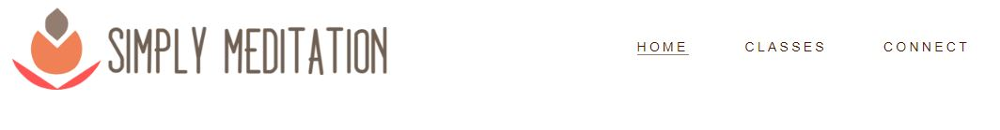
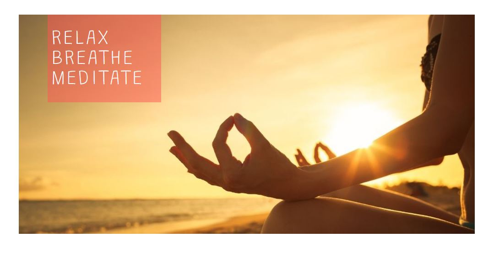

# Simply Meditation
Developer - Lynda Phelan

Simply Meditation is a website designed to promote a number of meditation classes in Dublin city provided by Simply Meditation Wellness Centre. As well as a space to list their meditation classes and provide additional information regarding different meditation styles and techniques covered by the centre, the site is also aesthetically designed to promote meditation as a way to bring more peace, calm and balance into one's everyday life. The site will target individuals who are looking to find a place that teaches meditation in a group setting from beginner level to more advanced meditation practices. Simply Meditation will be a user-friendly site which is easy to navigate for new users and returning users to find out exactly what meditation classes are on what day and at what time. The site will also promote Simply Meditation Wellness Centre as a warm welcoming environment and a space where users feel comfortable getting in touch to ask questions about meditation in general and/or the types of meditation classes that are being advertised.

[Live Webpage](https://lyn-da.github.io/simply-meditation/)

## Table of Content

1. [Project Goals](#project-goals)
    1. [User Goals](#user-goals)
    2. [Site Owner Goals](#site-owner-goals)
2. [User Experience](#user-experience)
    1. [Target Audience](#target-audience)
    2. [User Requrements and Expectations](#user-requrements-and-expectations)
    3. [User Stories](#user-stories)
3. [Design](#design)
    1. [Design Choices](#design-choices)
    2. [Colour](#colours)
    3. [Fonts](#fonts)
    4. [Structure](#structure)
    5. [Wireframes](#wireframes)
4. [Technologies Used](#technologies-used)
    1. [Languages](#languages)
    2. [Frameworks & Tools](#frameworks-&-tools)
5. [Features](#features)
6. [Testing](#validation)
    1. [HTML Validation](#HTML-validation)
    2. [CSS Validation](#CSS-validation)
    3. [Accessibility](#accessibility)
    4. [Testing user stories](#testing-user-stories)
8. [Unfixed Bugs](#unfixed-bugs)
9. [Deployment](#deployment)
10. [Credits](#credits)
11. [Acknowledgements](#acknowledgements)

## Project Goals

### User Goals
- Finding meditation classes offered in Dublin city centre
- See meditation class weekly schedule and pricing structure
- Find some basic information about the meditation classes on offer
- Find some basic information about meditation in general
- Find details regarding location of meditation classes
- Send message directly from site to enquire about meditation classes
- Find contact information 

### Site Owner Goals
- Promote meditation classes in Dublin city centre
- Increase numbers attending meditation classes
- Provide a way for prospective students to communicate with the business
- Provide essential information about the business
- Provide information about meditation to new and returning users 

## User Experience

### Target Audience
- Individuals who live in Dublin city or commuter distance
- Individuals who wish to learn how to meditate
- Individuals who wish to meditate within a group setting
- Individuals who wish to deepen their meditation practice
- Individuals who are just curious and seek some basic information about meditation

### User Requirements and Expectations
- A simple and intuitive navigation system
- To find relevant information quickly and easily
- Links and functions that work as expected
- Good presentation and a visually appealing responsive design
- To be able to reach out and contact the business easily
- Simple content that the user can skim read
- Accessibility

## User Stories

### First-time User
- As a first-time user, I want to know what meditation classes are on offer
- As a first-time user, I want to know how much it's going to cost me to attend a class
- As a first-time user, I want to know the location where the classes are being held
- As a first-time user, I want to know a little more about meditation 
- As a first-time user, I want to know a little more about the business
- As a first-time user, I want to send a message and enquire about attending a class

### Returning User
- As a returning user, I want to change my regular meditation class and try something new
- As a returning user, I want to find the contact details of the business 
- As a returning user, I want to connect with the business via social media
- As a returning user, I want to get directions to the business to send to a friend

## Design

### Design Choices
The website was designed to promote feelings of calm, peace, tranquility as well as togetherness. The overall look and feel of the site promotes the benefits of meditation on an individual level and on a social level. The images used and the visual space provided on the site promote the idea of expansion and balance.

### Colour
The colour scheme is both warm in some instances and cool in others. This play between both ends of the spectrum promotes a feeling of balance between warm and cool energies, which encourages an overall sense of peace and calm. The underlining message suggests that practicing meditation balances mind, body and soul.

### Fonts
- Quicksand was used for the body and Grandstander for headings.
- Grandstander was chosen to play off the logo font-family which is not available as a free font. 
- Quicksand was chosen for the body for accessibility reasons. 

### Structure
The website is structured in such a way that upon opening any of the pages, the user is immediately greeted with a familiar and user friendly structure including the business logo which is linked to homepage located on the top left, and an easy to navigate navigation bar located to the right of the logo.
The website consists of three separate pages: 
- A homepage with information about the business, general information about meditation, directions to find further information, a student testimonial, and a form to sign up to a newsletter, plus social media links
- A classes page with information on class schedule, some basic information about meditation styles and techniques, another student testimonial, and a form to sign up to a newsletter, plus social media links
- A connect page with a contact form to send enquiries directly to the business, directions and a map to business loaction, business contact information, another student testimonial, and a form to sign up to a newsletter, plus social media links

## Wireframes

Home

Classes

Connect

## Technologies Used

### Languages
- HTML
- CSS

### Frameworks & Tools
- Git
- GitHub
- Gitpod
- Balsamiq
- Google Fonts
- Font Awsome

## Features
The site consists of three pages and sixteen features

### Logo and Navigation Bar
- Featured on all three pages
- The navigation bar is fully responsive and identical on all three pages which allows for easy navigation
- Includes links to the Logo, Homepage, Classes and Connect page
- The active page is highlighted by an underline in the navigation menu
- This section is valable to the user as it allows the user to explore the site easily and without distraction

### Main Image
- Featured on all three pages
- Introduces the user to each page with an eye-catching image designed to promote a state of peace and happiness
- Includes an image which represents the nature of the site as well as the page that is currently open
- Each image includes a text overlay which highlights the nature of the site as well as the page that is currently open
- This section is fully responsive; when viewed on smaller devices the text overlay adjusts to the left and the image resizes accordingly
- This section is valable to the user as it provides a visual representation of how meditation can be incorporated into your life

### About Us Section
- Featured on Homepage
- Provides a short description about the Simply Meditation Wellness Centre (Left)
- Promotes a welcome message to all, encouraging a warm sense of curiosity in the user
- Includes an accompanying image which promotes meditation as something one can do with others (Right)
- This section underpins the idea of learning to meditate in a class setting
- Provides a design feature that runs across the site, promoting good user experience
- This section is fully responsive, changing from horizontal to vertical when viewed on smaller devices
- This section is valable to the user as it provides basic information that encourages a sense of familiarity and confidence

### About Meditation Section
- Featured on Homepage
- Provides a short description about the benefits of meditation for one's overall health and wellbeing (Right)
- Includes an accompanying image which points to the idea of achieving inner peace (Left)
- Both text and image encourages the user to consider joining a meditation class to gain the benefits outlined
- Provides a design feature that runs across the site, promoting good user experience
- This section is fully responsive, changing from horizontal to vertical when viewed on smaller devices
- This section is valable to the user as it provides basic information regarding the benefits of meditation

### Inspirational Quote Section
- Featured on Homepage
- Includes an image which represents the nature of the site overall and the chosen quote
- Image includes a text overlay with inspirational quote by Deepak Chopra, a prominent figure in the holistic wellness industry
- Image and text overlay is in keeping with the main image on all three pages thus creating a sense of aesthetic harmony
- This section is fully responsive, the image and overlay text adjusts in size when viewed on smaller devices
- This section is valable to the user as it suggests an alignment between Simply Meditation and a wellknown figure such a Deepak Chopra

### Further Information Section
- Featured on Homepage
- Includes a little info about where the user can find out more information on the site regarding meditation techniques, classes and enquiries
- Includes three hyperlinks that correlate with the titles: Techniques, Classes & Enquires, and directs the user accordingly across the site
- Includes a background image that covers the whole section, an image that leads nicely on from the above image displaying the quote
- The overall section is fully responsive, when viewed on smaller devices it changes from four vertical columns to three horizontal rows
- This section is valable to the user as it provides direction regarding where to find out more information and how to make an enquiry

### Testimonial Section 
- Featured on all three pages
- Provides the user social proof relative to the meditation classes run by Simply Meditation Wellness Centre (Left)
- Includes an accompanying image of the individual who is providing the testimonial (Right)
- Provides a design feature that runs across the site, promoting good user experience
- This section is fully responsive, changing from horizontal to vertical when viewed on smaller devices
- This section is valable to the user as it provides social proof, an invaluable asset to any business

### Newsletter Sign-Up Section
- Featured on all three pages
- Provides the user with an opportunity to sign up to a newsletter in order to receive the latest news from Simply Meditation
- Includes a form element which allows for the user to submit their email address to sign up for the newsletter
- Includes background image which continues to promote peace, calm and tranquility 
- Form element is displayed as a transparent text overlay which partly covers the background image 
- Sign Up Button is displayed as a bright pink colour to grab the attention of the user
- This section is full responsive, when viewed on smaller devices the text overlay adjusts accordingly and the image is resized
- This section is valuable to the user as it offers the user yet another way to receive information from Simply Meditation

### The Footer
- Featured on all three pages
- Includes links to Simply Meditation's Facebook, Twitter and Instagram accounts
- All links when clicked open in a new tab which allows for easy navigation
- This section is responsive, when viewed on the smallest viewport the footer reduces in size which creates better visual harmony
- This section is valuable to the user as it directs the user towards further engagement with Simply Meditation via social media

### Meditation Classes Section
- Featured on classes page
- Provides the user with information regarding class schedule and is broken up into five sections for mon-fri
- This section will be updated regularly as class days/times change
- Provides info such as what type of meditation class, what is the cost to attend the class, what day of the week it's on and at what time
- The overall section includes a background image of an artistic nature which is also utilised for the techniques section allowing for visual consistency
- The overall section is fully responsive, when viewed on smaller devices it changes from five vertical columns to five horizontal rows
- This section is valuable to the user as it provides vital information regarding pricing structure and class scheduling

### Meditation Styles Section
- Featured on classes page
- Provides the user with information regarding the three main meditation styles covered by Simply Meditation Wellness Centre
- The overall section includes a background image of an artistic nature which was utilised already for the further information section on the homepage, allowing for visual consistency and good user experience
- The overall section is fully responsive, when viewed on smaller devices it changes from three vertical columns to three horizontal rows
- This section is valuable to the user as it provides information regarding the different meditation styles and what the user can expect to learn

### Meditation Techniques Section
- Featured on classes page
- Provides the user with information regarding some meditation techniques covered in class by Simply Meditation
- The overall section includes a background image of an artistic nature which is also used for the classes section allowing for visual consistency
- The overall section is fully responsive, when viewed on smaller devices it changes from five vertical columns to five horizontal rows
- This section is valuable to the user as it provides more information regarding different meditation techniques one can expect to learn

### Simply Connect Section
- Featured on connect page
- Provides a little message about reaching out if the user has any questions (Left)
- Includes an accompanying image which promotes making contact and connecting with the centre (Right)
- Provides a design feature that runs across the site, promoting good user experience
- This section is fully responsive, changing from horizontal to vertical when viewed on smaller devices
- This section is valable to the user as it promotes the idea that the user is most welcome to connect

### Contact Information Section
- Featured on connect page
- Includes vital contact information: loaction, contact number and email address
- Includes a background image that covers the whole section, a suggestive image regarding making contact
- The overall section is fully responsive, when viewed on smaller devices it changes from four vertical columns to three horizontal rows
- This section is valable to the user as it provides vital contact information

### Map Section
- Featured on connect page
- Shows the location of the wellness centre on an embeded Google Map (Left)
- Provides written directions to the location (Right)
- Provides a design feature that runs across the site, promoting good user experience
- This section is fully responsive, changing from horizontal to vertical when viewed on smaller devices
- This section is valable to the user as it provides an actual location for the centre

### Send Message Form Section
- Featured on connect page
- Provides an opportunity for the user to ask a question or leave feedback directly from the site
- Includes a form element which allows the user to submit their name, email address, contact number, and message to Simply Meditation
- Includes background image which continues to promote peace, calm and tranquility 
- Form element is displayed as a transparent text overlay which partly covers the background image 
- Send Message Button is displayed as a bright pink colour to grab the attention of the user
- This section is full responsive, when viewed on smaller devices the text overlay adjusts accordingly and the image is resized
- This section is valuable to the user as it offers the user a direct way to communicate with Simply Meditation

## Features Left to Implement
- Scheduling and Booking facility
- About us page
- Gallery page
- Free Resources page
- Thank you for your message page
- Customised error 404 page

## Validation

### HTML Validation
The W3C Markup Validation Service was used to validate the HTML of the website. All three pages pass with no errors no warnings to show.

Home

Classes

Connect

### CSS Validation
The W3C Jigsaw CSS Validation Service was used to validate the CSS of the website. The site passes with no warnings and no errors to show. 

whole page

### Accessibility
The WAVE WebAIM web accessibility evaluation tool was used to ensure the website met high accessibility standards. All pages pass with little to no errors.

### Testing user stories

1. As a first-time user, I want to know what meditation classes are on offer
| **Feature** | **Action** | **Expected Result** | **Actual Result** |
|-------------|------------|---------------------|-------------------|
| Classes | Navigate to Classes Page, Scroll Down to Classes Schedule | Locate Schedule | Works as expected |

Screenshots

Screenshots

## Unfixed Bugs

## Deployment
The website was deployed using GitHub Pages by following these steps:
1. In the GitHub repository navigate to the Settings tab
2. On the left hand menu select Pages
3. For the source, select Branch: master
4. Once the master branch has been selected, the page will be automatically refreshed with a detailed ribbon display indicating successful deployment
The live link can be found here - https://lyn-da.github.io/simply-meditation/

## Credits

### Content 

### Media

### Code

## Acknowlegements

